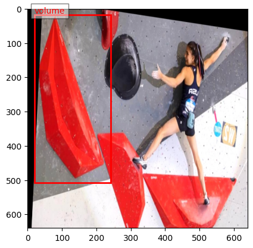
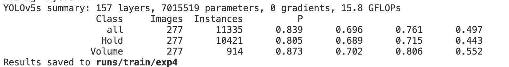
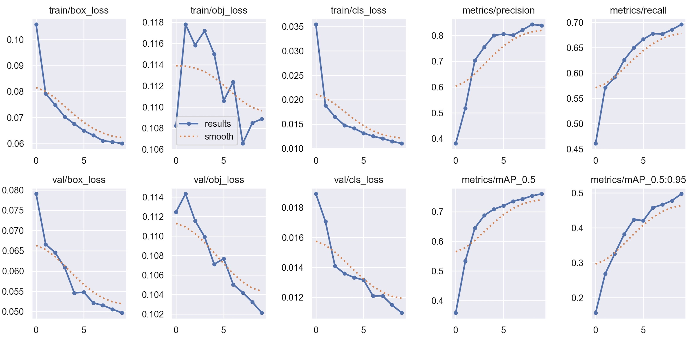
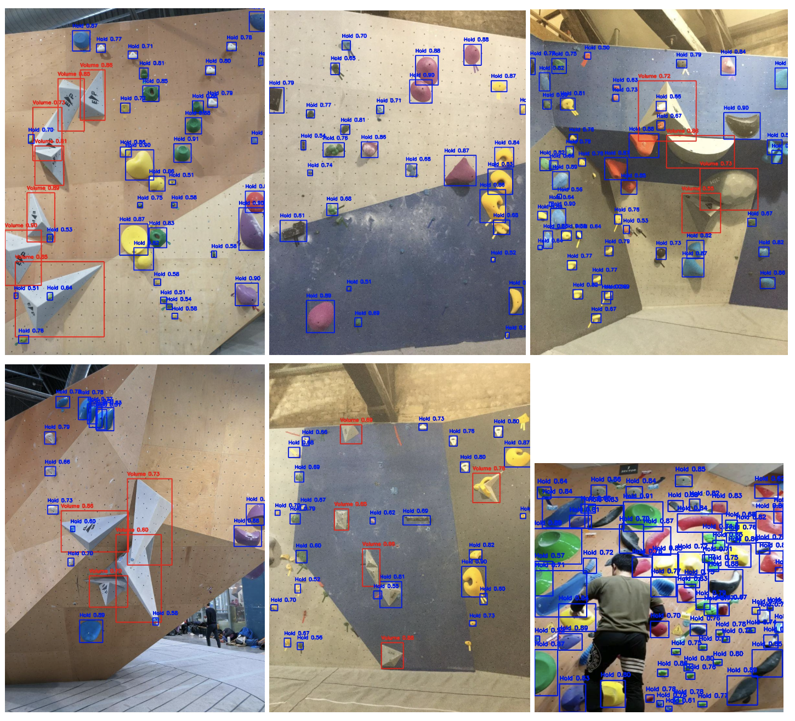

# YOLOv5 Object Detection for Rock Climbing Holds & Volumes

## Overview
This project trains a YOLOv5 model to detect **rock climbing holds and volumes** from images. The dataset is processed into YOLO format, augmented for class balance, and trained using YOLOv5. Non-Maximum Suppression (NMS) is applied to refine predictions, followed by evaluation against ground truth annotations.

## Directory Structure
```
Identifying-and-Classifying-Climbing-Holds-and-Volumes/
│── yolov5/                          # A submodule linking to the YOLOv5 repository for object detection.
│
│── data/                             # Raw dataset
│   ├── yolo_data/                    # YOLO-formatted dataset
│   │   ├── train/
│   │   │   ├── images/               # Training images formatted for YOLO
│   │   │   ├── labels/               # Corresponding labels in YOLO format
│   │   ├── valid/
│   │   │   ├── images/               # Validation images formatted for YOLO
│   │   │   ├── labels/               # Corresponding labels in YOLO format
│
│── augmented_data/                    # Augmented dataset for class balancing
│   ├── augmented_images/              # Augmented images
│   ├── augmented_labels/              # Corresponding labels for augmented images
│
│── notebooks/                         # Jupyter notebooks for data processing and training
│   ├── data_extract.ipynb             # Extracts data for training
│   ├── main.ipynb                     # Main training pipeline
│
│── annotations/                        # COCO-format annotation files
│   ├── test_coco_annotations.csv       # Test set annotations
│   ├── train_coco_annotations.csv      # Training set annotations
│   ├── valid_coco_annotations.csv      # Validation set annotations
│
│── .gitignore                          # Ignore unnecessary files (e.g., model weights, cache)
│── README.md                           # Project documentation


```

## Dataset Preparation
### 1. Convert COCO Annotations to YOLO Format
Run the script to process COCO-style annotations into YOLO format:

### 2. Apply Data Augmentation
Due to data imbalance, additional transformations such as oversampling and targeted data augmentation are applied to volume data to improve model performance.


## Training YOLOv5
To train the YOLO model with the prepared dataset:
```sh
python yolov5/train.py --img 416 --batch 8 --epochs 30 --data yolo_data/data.yaml --weights yolov5s.pt --project runs --name hold_volume_detection --workers 4
```

## Results




## Acknowledgments
- YOLOv5 by Ultralytics: https://github.com/ultralytics/yolov5
- Image Augmentation: Albumentations & Imgaug libraries

